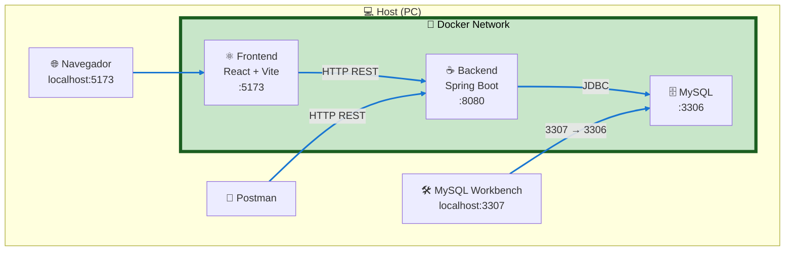

# Gestión de Congresos - Deploy

Repositorio encargado de levantar el entorno de desarrollo del proyecto **Gestión de Congresos** utilizando Docker Compose.

## Descripción

Este repositorio contiene la configuración necesaria para ejecutar los servicios del proyecto en contenedores Docker.

Actualmente se incluyen los siguientes servicios:

- Frontend (React + Vite)
- Backend (Spring Boot)
- Base de datos MySQL 8.4

El objetivo es que cualquier integrante del equipo pueda clonar el repositorio y levantar el entorno completo con un único comando.

---

# Requisitos

Antes de comenzar es necesario tener instalado:

* Docker Desktop
* Git

Se recomienda verificar la instalación ejecutando:

```bash
docker --version
docker compose version
```

---

# Clonar los repositorios

El proyecto está compuesto por tres repositorios independientes:

- gestion-congresos-backend
- gestion-congresos-frontend
- gestion-congresos-deploy

Se recomienda mantener la siguiente estructura de carpetas:

```text
Proyecto TFI/
│
├── gestion-congresos-backend
├── gestion-congresos-frontend
└── gestion-congresos-deploy
```

Clonar cada repositorio:

```bash
git clone <URL_BACKEND>
git clone <URL_FRONTEND>
git clone <URL_DEPLOY>
```

Ingresar al repositorio de despliegue:

```bash
cd gestion-congresos-deploy
```

---

# Configuración

Crear un archivo llamado `.env` en la raíz del proyecto tomando como referencia el archivo `.env.example`.

Ejemplo:

```properties
MYSQL_DATABASE=gestion_congresos
MYSQL_USER=gestion_congresos_user
MYSQL_PASSWORD=tu_password
MYSQL_ROOT_PASSWORD=tu_root_password
```

---

# Levantar el entorno

Una vez descargados los tres repositorios y configurado el archivo `.env`, ejecutar desde el repositorio **gestion-congresos-deploy**:

```bash
docker compose up --build
```

Este comando realizará automáticamente:

- Construcción de la imagen del Frontend.
- Construcción de la imagen del Backend.
- Creación de la red Docker.
- Creación del contenedor MySQL.
- Inicio de todos los servicios.

Para ejecutar en segundo plano:

```bash
docker compose up -d --build
```

---

# Detener el entorno

```bash
docker compose down
```

---

# Reconstruir las imágenes

Si se modifica el `Dockerfile` o el `docker-compose.yml`, volver a construir las imágenes:

```bash
docker compose up --build
```

---

# Acceso a los servicios

## Backend (Spring Boot)

URL:

```
http://localhost:8080
```

Ejemplo de endpoint de prueba:

```
http://localhost:8080/api/users/test
```
## Frontend (React + Vite)

URL:

```
http://localhost:5173
```
## Base de datos MySQL

Desde MySQL Workbench:

| Parámetro     | Valor                         |
| ------------- | ----------------------------- |
| Host          | localhost                     |
| Puerto        | 3307                          |
| Base de datos | gestion_congresos             |
| Usuario       | gestion_congresos_user        |
| Contraseña    | definida en el archivo `.env` |

> **Nota:** El puerto **3307** corresponde al equipo anfitrión (host) y se redirige al puerto **3306** del contenedor de MySQL.

---

# Comandos útiles

Ver los contenedores en ejecución:

```bash
docker ps
```

Ver los logs:

```bash
docker compose logs
```

Seguir los logs en tiempo real:

```bash
docker compose logs -f
```

Detener y eliminar los contenedores:

```bash
docker compose down
```

Eliminar también los volúmenes asociados:

```bash
docker compose down -v
```

Reconstruir las imágenes:

```bash
docker compose up --build
```

---

# Estructura del repositorio

```
gestion-congresos-deploy
│
├── docker-compose.yml
├── .env.example
├── .gitignore
└── README.md
```

---

# Tecnologías utilizadas

- Docker
- Docker Compose
- React + Vite
- Spring Boot
- MySQL 8.4

---

# Notas

* El backend se expone en el puerto **8080**.
* MySQL se expone en el puerto **3307** del equipo anfitrión y utiliza el puerto **3306** dentro del contenedor.
* El backend no se comunica con MySQL mediante `localhost`, sino utilizando el nombre del servicio definido en `docker-compose.yml`.
* El archivo `.env` no debe subirse al repositorio. Cada integrante del equipo debe crear su propia copia a partir de `.env.example`.
* El frontend se expone en el puerto **5173**.


# Arquitectura del Proyecto


